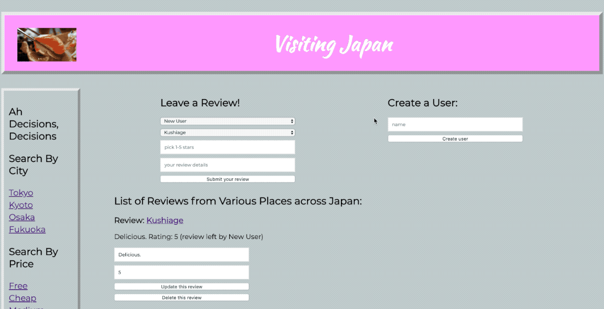

About this Project:

This is a review platform created for the country of Japan. It allows you to look up reviews for various places ranging from bars, to restaurants, shopping malls, and other various attractions this country has to offer.

Once you have an opportunity to visit Japan, you can check out the various places that interest you. You're even able to filter your results by city, price, and category.

Upon returning from your trip to Japan based on checking out all the recommendations from the website, you can add yourself to the site as a user, and then leave a review for any of the places you may have checked out!

Reviews can range anywhere from 1-5 stars and you can even leave a description too to specify why you left the rating that you did. All the user creations, places of interest, and reviews from every user are stored on the server.

If you are ever interested in updating a review about a place you visited, you just need to login like so, and click the update button, and it will allow you to update the rating or description regarding any of the places you've left a review about.

If you messed up about what you were trying to say or just changed your mind about leaving a review, you can just delete that review as well and make or not make... a new one!

